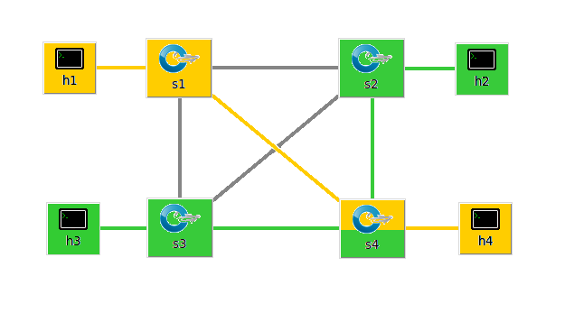

# On Demand SDN Slices in ComNetsEmu

The goal of this project is to enable the activation and removal of slices within a network managed by a single controller using the Openflow protocol.

## Configuration File

The configuration of the network (managed by Mininet) and the configuration of the controller (Ryu Controller) can be modified at will by a CONFIGURATION FILE. Below you can see an example of a configuration file for a simple network.

````
[CONFIG]
number_of_switches = 3
number_of_hosts = 6
number_of_links = 8
number_of_slices = 2

[LINK_0] 
bandwidth = 10
node1 = h1
node2 = s1
slice = 1

[LINK_1]
bandwidth = 10
node1 = h2
node2 = s1
slice = 2

[LINK_2]
bandwidth = 10
node1 = h3
node2 = s2
slice = 1

[LINK_3]
bandwidth = 10
node1 = h4
node2 = s2
slice = 2

[LINK_4]
bandwidth = 10
node1 = h5
node2 = s3
slice = 1   

[LINK_5]
bandwidth = 10
node1 = h6
node2 = s3
slice = 2

[LINK_6]
bandwidth = 10
node1 = s1
node2 = s2
slice = 1, 2

[LINK_7]
bandwidth = 10
node1 = s1
node2 = s3
slice = 1, 2

[LINK_8]
bandwidth = 10
node1 = s2
node2 = s3
slice = 1, 2
````

This configuration file translates to the following network:
<p align="center">
    <br>
    <i>This configuration is for illustrative purposes only</i>
</p>

The same configuration file is parsed by two different python scripts that respectively build the virtual network using Mininet and correctly configure the Ryu controller.

In the configuration file, it is necessary to define:
- The number of switches and the number of hosts
- The number of different slices
- The number of links and for each of them define the bandwidth, the nodes it connects and the slice it belongs to
- (Optional) You can define names to the switches that override the default ones

## How to run

To run the project, it is necessary to first run the Ryu controller and later build the network.

Initially perform to start the Ryu controller:
````
./controller.py -f <path_to_configuration_file>
````

Later in a second terminal to build the network, run:
````
sudo ./network.py -f <path_to_configuration_file>
````

Note that both scripts have other possible flags available, viewable with the '--help' option

## Limitations

The “basic” version of the controller supports ONLY simple slicing configurations and does not work with any network and any configuration. 

The supported configurations are those in which there are no cycles between switches belonging to a given slice. A switch belongs to a slice if it has at least one link that belongs to the given slice.

An example of an unsupported configuration is as follows:
<p align="center">
    
</p>

Switches s2, s3, and s4 belong to the green-colored slice, and it is possible to identify a path starting at s2 and ending at s2 without passing over the same switch twice (s2 -> s4 -> s3 -> s2). Note that the color of the links, i.e., the slice they belong to, is not to be considered during this check.

## Examples of working configurations

### Fully connected graph with 4 switches
<p align="center">
    
    
</p>

### Fully connected graph with 5 switches
<p align="center">
    
    
</p>


## Spanning Tree Protocol version of the controller

To support more complex networks, you can use the ‘--stp’ flag that enables Spanning Tree Protocol. Using this feature it is NOT possible to assign a slice to a Switch-Switch link but only to Host-Switch links.

````
./controller.py -f <path_to_configuration_file> --stp
````

Below is an example of a network using STP. Links are not assignable to a given slice and some will be disabled by the protocol action.
<p align="center">
    
</p>    

## Bonus: The GARR network
Within the configuration file ‘configs/garr.ini’ is the garr network already divided into the three slices “operational,” “TeRABIT,” and “ICSC.” The network can be used with the flag '--stp'

<p align="center">
    
</p>  
